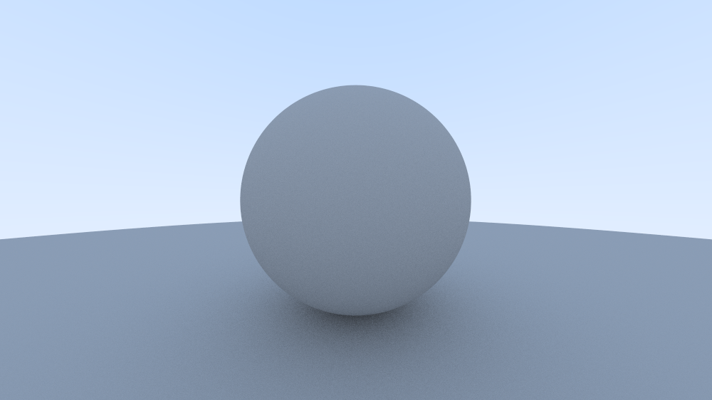

# Rust Ray Tracing in One Weekend
> okay but what if we did it in rust

I am going through [Ray Tracing in One Weekend](https://raytracing.github.io/books/RayTracingInOneWeekend.html) to learn Rust. I am trying not to rely on any additional crates, and implement everything myself.

----

## Why

Compare & Contrast! C vs Rust.

----

## PPM
I use [this website](https://kylepaulsen.com/stuff/NetpbmViewer/) to convert the PPM into viewable photos. For some reason I cannot get it to display properly on my local computer. Too lazy to figure that out, as I'm running a rolling distro + wayland + nvidia, so it could be anything at this point. That online viewer works well enough for me.

----

## Current Progress

## Disclaimer

Everything is super alpha / early stage. Yes there are ways I can make the code cleaner and more consistent, but at this point I am more worried about getting it to work, than anything else.

Thanks for coming! xoxo